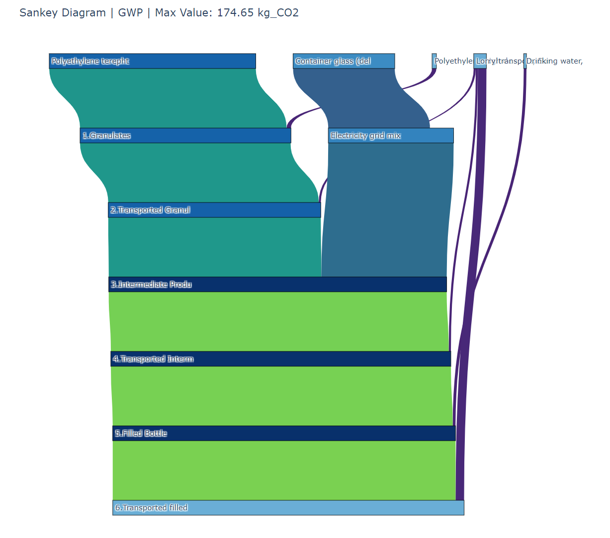

# Custom Sankey Diagram for openLCA Contribution Tree



## General Description
This project is designed to create a custom Sankey diagram based on the data exported from the openLCA Contribution Tree in Excel format. It processes the input data, structures it for visualization, and generates a Sankey diagram using Plotly. The Sankey diagram provides a clear graphical representation of the contribution flows between nodes in the tree, with various options to customize the output.

## Installation

1. Clone the repository:
   ```bash
   git clone https://github.com/Fernando3161/openLCA_Sankey.git
   cd REPO_PATH
   ```

2. Create a virtual environment and install the dependencies
    ```bash
    python -m venv venv
    source venv/bin/activate  # On Windows, use `venv\Scripts\activate`
    pip install -r requirements.txt
    ```
## Description
This code takes an Excel file from the openLCA Contribution Tree and generates a Sankey diagram. The diagram illustrates the contribution flow between various nodes based on their impacts.

## Key Features:
* **Input:** The input file is an Excel sheet containing the contribution tree structure, including source and target nodes, and their respective contribution values (e.g., Global Warming Potential).
* **Data Processing:** The code cleans the data by removing unwanted columns, dropping negative results, and shortening overly long labels for better visual clarity.
* **Flow and Node Creation:** It calculates the source and target relationships and assigns unique labels to ensure no overlap.
* **Visualization:** The Sankey diagram is built using Plotly, with nodes colored based on their contribution, and flows colored using a Seaborn-style colormap.
* **Output:** The diagram is saved as an interactive HTML file and a PNG image.

## Available Configuration Options
* REMOVE_BACK_INFO:** When set to True, it removes background information, simplifying the flow representation.
* SHORTEN_LABELS:** When enabled, labels are shortened to improve the diagram’s readability.
impact_name and unit_name: Customize the title of the Sankey diagram to reflect the impact being visualized (e.g., GWP for Global Warming Potential).

## Example Usage
To use this project, modify the following variables in the script:

* file_path: Path to the Excel file exported from openLCA.
* sheet_name: The name of the sheet within the Excel file to be used.
* impact_name and unit_name: These will define the title and units displayed on the Sankey diagram.

After running the script, the Sankey diagram will be saved in an interactive HTML format, and a PNG image can be generated for further use.

## Acknowledgments
This project was developed by Fernando Penaherrera V.
For any questions or inquiries, feel free to reach out at: fernandoandres.penaherreravaca@offis.de.

This code was developed with the help of ChatGPT (version: October 2024).